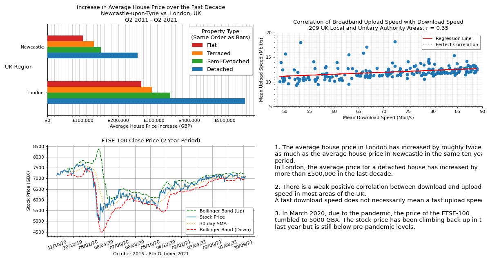
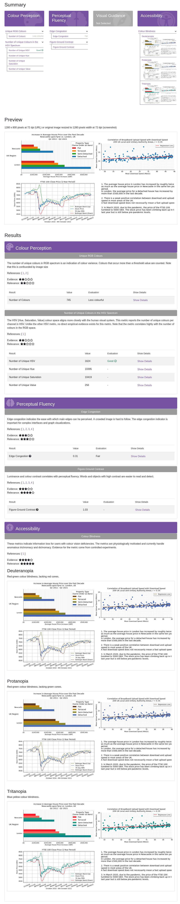

# State of the Nation - A Data Visualisation Task

---

This repository contains a python script to generate visualisations using matplotlib for a Data Visualisation and Visual Analytics university module.  
The task aims to produce meaningul and accurate visualisations considering the Gestalt principles of design as well as empirically measurable design metrics based on human perception theory, such as edge congestion, colourfulness and colour-blind readability.

---

# Evaluation using [Aalto Interface Metrics Service](https://interfacemetrics.aalto.fi/)

Project on [Github](https://github.com/aalto-ui/aim)

